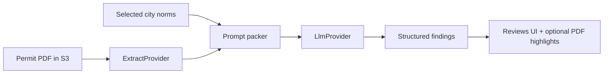

# AI review architecture

Design for comparing a building permit document to selected city norms with an LLM.

**Related**

- Plan to review later: [plans/ai-local-first-aws-ready.md](./plans/ai-local-first-aws-ready.md)
- Test checklist: [ai-test-plan.md](./ai-test-plan.md)
- Stub API today: `POST /api/reviews` in `src/api/reviews.ts`

## Status today

| Piece | Status |
| --- | --- |
| Permit PDF upload + viewer + highlights | Done (MVP) |
| City norms (paste / upload / web stub) | Done (MVP) |
| Stub review run (`permitId` + `normIds`) | Done (no extract, no LLM) |
| Extract + LLM providers | Designed; not implemented |
| Amazon Textract / Bedrock | Designed as Phase B swap-in |
| RAG + pgvector retrieval | Designed as Phase C; Compose already enables pgvector |

## Glossary

| Term | What it is | Role in this app |
| --- | --- | --- |
| **Extract / OCR** | Turn a digital or scanned PDF into text (and sometimes page geometry) | Feed the model the permit content |
| **Amazon Textract** | AWS document OCR API | Production extract provider (Phase B) |
| **LLM** | Large language model that reasons over packed text | Compare permit text vs norms; return findings |
| **Amazon Bedrock** | AWS managed API to call models (for example Claude) without self-hosting | Production LLM provider (Phase B) |
| **Prompt packing** | Put extracted permit text + selected norm text into one prompt (or a small message set) | Phase A and Phase B default |
| **RAG** | Retrieval-augmented generation: chunk docs, embed vectors, retrieve only relevant passages | Phase C when norms are too large to paste |
| **Embeddings** | Numeric vectors for text chunks | Used only in the RAG phase |
| **pgvector** | Postgres extension for vector similarity search | Store embeddings in the same DB you already run |
| **Provider interface** | Small TypeScript contract with swappable implementations | Lets local and AWS backends share one pipeline |

## End-to-end pipeline



Steps (same booking the stub already records):

1. User selects a **permit** and one or more **city norms**.
2. **ExtractProvider** reads the permit PDF from object storage and returns page text.
3. **packReviewPrompt** builds messages from extract + selected norms + permit metadata (`title`, `type`).
4. **LlmProvider** returns structured findings (pass/fail, note, optional page / citation).
5. App persists the review run and shows findings. Later: map a finding to a PDF highlight.

## Decision: local-first, then AWS, then RAG

| Phase | Name | Extract | LLM | When |
| --- | --- | --- | --- | --- |
| **A** | Local-first | Local PDF text extract (digital PDFs) | Local or cheap gateway model behind `LlmProvider` | First real AI loop; no AWS required |
| **B** | AWS production shape | Amazon Textract | Amazon Bedrock | Scanned permits + managed models |
| **C** | RAG | Same as A/B | Same as A/B + retrieved chunks | Selected norms routinely overflow context |

Keep **extract + pack selected norms** until corpora force RAG. Explicit norm selection is easier to debug and keeps the product honest about what was reviewed.

## Provider interfaces (AWS-ready without AWS yet)

Implement later under something like `src/lib/ai/`. Design contracts now:

### ExtractProvider

- **Input:** document id / storage key / bytes
- **Output:** `{ pages: [{ page: number; text: string }]; rawRef?: string }`
- **Implementations:**
  - `LocalPdfExtractProvider` (Phase A)
  - `TextractExtractProvider` (Phase B; same interface)

### LlmProvider

- **Input:** packed messages + response JSON schema
- **Output:** structured findings
- **Implementations:**
  - `LocalOrGatewayLlmProvider` (Phase A)
  - `BedrockLlmProvider` (Phase B; same interface)

### Shared orchestration

- `packReviewPrompt(permitExtract, norms, permitMeta)` - pure function; no AWS imports
- `runReviewPipeline(reviewRunId)` - load inputs → extract → pack → LLM → persist findings

Env switch (document now; wire later):

```text
EXTRACT_PROVIDER=local|textract
LLM_PROVIDER=local|bedrock
```

Same review API and UI. Only the provider modules change when you move to Amazon.

## Phase A: local-first

1. Extract text from digital PDFs with a library (selectable text). Scanned image-only PDFs may return empty text; that is expected until Textract.
2. Call a local or cheap LLM through `LlmProvider`.
3. Validate findings against a fixed JSON schema.
4. Surface findings on the Reviews page. Optional: create highlights from findings that include a page number.

## Phase B: Amazon Textract + Bedrock

Drop-in replacements for the same interfaces:

1. Point `EXTRACT_PROVIDER=textract`. Send the PDF (or S3 object) to Textract; map blocks to `{ page, text }`.
2. Point `LLM_PROVIDER=bedrock`. Send packed messages to a Bedrock model; parse structured output.
3. Keep IAM least-privilege, region, and cost logging outside the UI.

You do not rewrite the review API or prompt packer. You add provider classes and flip env vars.

## Phase C: pgvector RAG (later)

Add only when selected norms routinely exceed reliable context windows, or when users keep large municipal libraries.

1. Chunk `norm_docs` into `norm_chunks`.
2. Embed chunks; store vectors with **pgvector** in the same Postgres instance.
3. Retrieve top-k passages for the permit under review.
4. Pack retrieved passages (not the entire corpus) into the LLM prompt.
5. Cite chunk ids in findings.

Compose already enables pgvector. Tables are not created until this phase.

## App gaps (what you still need before real AI)

### Product / data

- APIs still use the **in-memory mock store**, not Prisma
- No durable **extract cache** (page text / Textract JSON)
- No **ReviewFinding** (or similar) model for structured LLM output
- Review status is a free string (`stubbed`); need a real lifecycle, for example `queued` → `extracting` → `running` → `succeeded` / `failed`
- No background job path (long OCR/LLM on the request thread will time out later)
- No cost / token logging

### AI

- No `ExtractProvider` / `LlmProvider` code yet
- No prompt templates or findings JSON schema in repo
- No evaluation fixtures (sample permit + norms + expected findings)
- No `norm_chunks` table yet (mentioned only in [database.md](./database.md))

## Suggested schema additions (design only)

Not migrated yet. Capture intent for a later Prisma migration:

- **document_extracts** - `document_id`, `provider`, `pages_json` or storage ref, `created_at`
- **review_findings** - `review_run_id`, `severity` / `status`, `note`, `page`, `norm_doc_id` (optional), `raw_json`
- **review_runs** - richer `status`, optional `error`, `started_at`, `finished_at`, token/cost fields
- **norm_chunks** (Phase C) - `norm_doc_id`, `chunk_index`, `content`, `embedding vector`

## Out of scope for the current MVP code

- Calling any LLM provider
- Streaming review results
- Evaluation harnesses
- Automatic municipal site crawling (UI stub only via `source: "web_stub"`)
- Wiring Textract or Bedrock SDKs

## What to read next

1. [plans/ai-local-first-aws-ready.md](./plans/ai-local-first-aws-ready.md) - plan summary for later review
2. [ai-test-plan.md](./ai-test-plan.md) - how to test each phase
3. [database.md](./database.md) - entities and future `norm_chunks`
4. [api.md](./api.md) - current stub review endpoint
