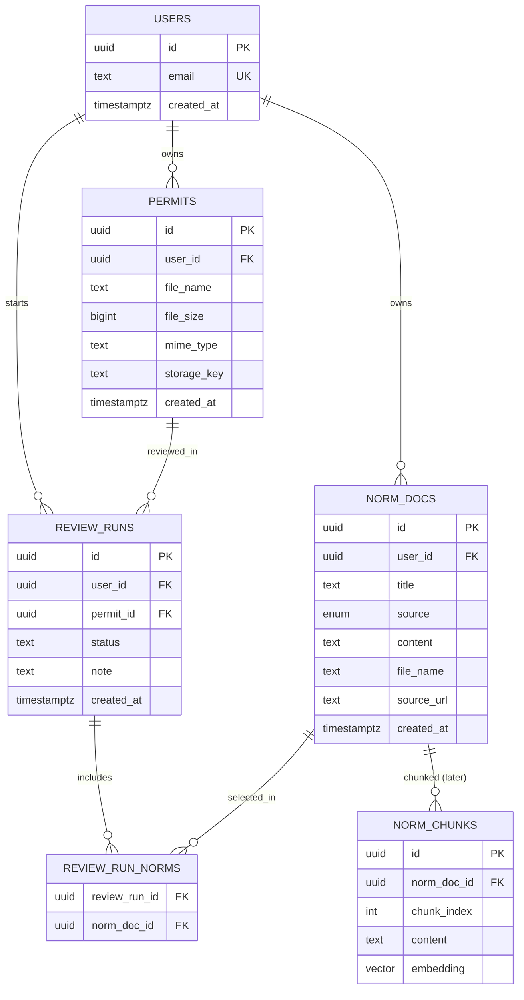

# Database

This project uses **Prisma** for the schema, migrations, and (later) queries.

- Prisma guide: [prisma.md](./prisma.md)
- Schema: `prisma/schema.prisma`
- Migrations: `prisma/migrations/` (sequential `0001_...`, `0002_...`)
- Migration changelog: `prisma/migrations/README.md`
- Client: `src/lib/db/client.ts`

Local runtime: Colima + Compose (`docker/docker-compose.yml`) using `pgvector/pgvector:pg16`.

## Apply tables

```bash
colima start
npm run docker:up
cp .env.example .env.local    # once
npm run db:migrate
```

| Script                      | What it does                                       |
| --------------------------- | -------------------------------------------------- |
| `npm run docker:up`         | Start Postgres container                           |
| `npm run docker:down`       | Stop Postgres container                            |
| `npm run db:migrate`        | Apply pending Prisma migrations (`migrate deploy`) |
| `npm run db:migrate:dev`    | Create/apply migrations while editing the schema   |
| `npm run db:migrate:status` | Show migration status                              |
| `npm run db:reset`          | Wipe Docker volume and re-apply migrations         |
| `npm run db:studio`         | Open Prisma Studio                                 |
| `npm run db:generate`       | Regenerate Prisma Client                           |

## Up / down note

Prisma is **forward-migration** oriented:

- **Up / apply:** `npm run db:migrate`
- **Change schema:** edit `prisma/schema.prisma`, create the next numbered migration, document why in `prisma/migrations/README.md`
- **Local full rollback:** `npm run db:reset`

Details: [prisma.md](./prisma.md).

## Folder split

| Path                           | Contents                                 |
| ------------------------------ | ---------------------------------------- |
| `prisma/schema.prisma`         | Models / enums (source of truth)         |
| `prisma/migrations/000N_name/` | One sequential migration each            |
| `prisma/migrations/README.md`  | Naming rules + why each migration exists |
| `src/lib/db/`                  | Prisma client singleton                  |
| `docker/`                      | Postgres + pgvector Compose service      |

## Entities

- **users**: keyed by email for the mock-auth era. Later map Clerk user IDs here.
- **permits**: PDF metadata and storage pointer (object storage key later).
- **norm_docs**: city-norm context (paste, upload, or future web-fetched content).
- **review_runs**: selected permit + norms for an LLM review attempt.
- **review_run_norms**: join table for many norms per review.
- **norm_chunks** (later): chunked text + optional `vector` embedding for RAG.

## Migrations today

| #   | Folder      | Purpose                                                                                 |
| --- | ----------- | --------------------------------------------------------------------------------------- |
| 1   | `0001_init` | Baseline: `vector` extension + users, permits, norm_docs, review_runs, review_run_norms |

See the full changelog in [`prisma/migrations/README.md`](../prisma/migrations/README.md).

## ERD



## Notes

- One Postgres database for relational data and (later) vectors.
- Host port in local Compose is `5433`.
- MVP API handlers still use `src/lib/mock`. Prisma is ready for the durable wiring pass.
