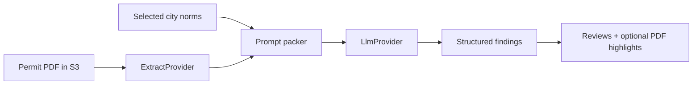

# Plan: AI local-first, AWS-ready

**Status:** Design documented. Implementation not started.  
**Saved for review:** you can reopen this file anytime.

## Goal

1. Document how AI review will work (Bedrock, Textract, RAG, gaps).
2. Shape Phase A as **local extract + local/cheap LLM**.
3. Shape Phase B so **Amazon Textract + Amazon Bedrock** plug in behind the same interfaces.
4. Keep a concrete test plan for each phase.

## Path chosen

1. **Docs first** (this folder + [ai-architecture.md](../ai-architecture.md) + [ai-test-plan.md](../ai-test-plan.md))
2. **Local-first implementation** next (when you ask to build it)
3. **AWS path** after local loop works (`EXTRACT_PROVIDER=textract`, `LLM_PROVIDER=bedrock`)

## Pipeline (plain language)



## What exists today

- Permit + Document model, LocalStack S3, PDF viewer, highlights
- City norms UI + API
- Stub review: `POST /api/reviews` with `{ permitId, normIds }` (`src/api/reviews.ts`)
- Prisma `ReviewRun` / `ReviewRunNorm` (migrations exist; API still uses mock store)
- Compose Postgres with pgvector enabled for a later RAG phase

## Gaps to close before real AI

- Mock store → Prisma for durable reviews and findings
- `ExtractProvider` + `LlmProvider` interfaces and local implementations
- Extract cache + review findings schema
- Review status lifecycle beyond `stubbed`
- Background jobs for long OCR/LLM work
- Eval fixtures
- Later: Textract, Bedrock, then RAG / `norm_chunks`

## Provider switch (design)

```text
EXTRACT_PROVIDER=local|textract
LLM_PROVIDER=local|bedrock
```

| Phase | Extract | LLM |
| --- | --- | --- |
| A | Local PDF text | Local / cheap gateway |
| B | Amazon Textract | Amazon Bedrock |
| C | Same as A/B | Same + retrieved norm chunks (RAG) |

## Implementation order (after docs)

1. Findings schema + review status fields (Prisma)
2. `src/lib/ai` providers + `packReviewPrompt` + `runReviewPipeline`
3. Wire `POST /api/reviews` to start the pipeline (sync first; jobs later)
4. Reviews UI shows findings
5. Swap env to Textract + Bedrock
6. Add RAG only if norms outgrow context

## Out of scope until you ask

- Coding providers, Bedrock SDK, Textract SDK
- Job queues
- Municipal site crawling

## Where to read more

- Design: [../ai-architecture.md](../ai-architecture.md)
- Tests: [../ai-test-plan.md](../ai-test-plan.md)
- Database notes: [../database.md](../database.md)
